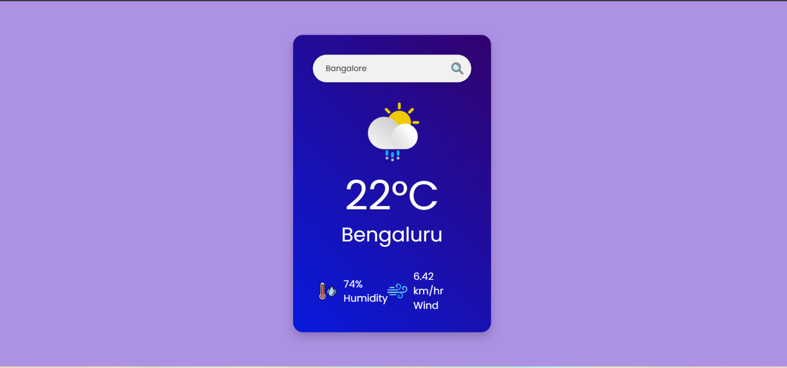

# 🌤️ React Weather App

A modern weather forecast application built with **React** and **OpenWeatherMap API**. Users can search any city to view real-time weather conditions including temperature, humidity, wind speed, and weather icons.

---

## 📸 Screenshot

---

## 🚀 Features

- 🌍 Search for any city
- 🌡️ Display temperature in °C
- 💧 Shows humidity and wind speed
- 🌦️ Weather condition icons
- 🔄 Auto-fetch weather on load 

---

## 🛠️ Tech Stack

- **React** (Vite)
- **CSS**
- **OpenWeatherMap API**

---

